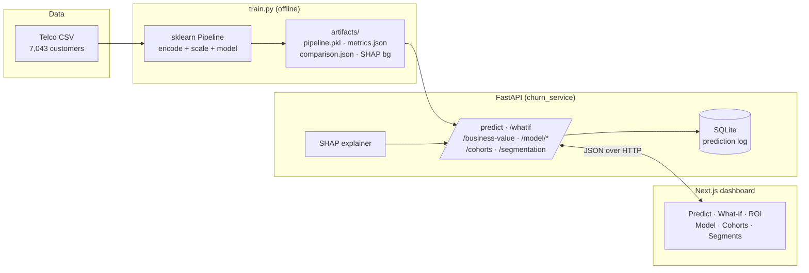

# Customer Churn Prediction Dashboard

An end-to-end machine-learning application that predicts telecom customer churn
and turns each prediction into an **explanation** and a **business decision** —
which customers to target, and what it's worth in dollars.

Trained on the [IBM Telco Customer Churn dataset](https://www.kaggle.com/datasets/blastchar/telco-customer-churn)
(7,043 real customers), served by a FastAPI + scikit-learn backend, and
visualized in a Next.js dashboard.

> **Why this project is different from a typical churn demo:** the numbers are
> real. Metrics come from a held-out test set (not hard-coded), predictions run
> a genuinely trained model, feature attributions use SHAP, and the ROI page
> connects model output to money. Nothing on the dashboard is faked when the API
> is running.

<!-- Add a screenshot or GIF here once deployed:
 -->

---

## Highlights

| Capability | What it does |
|---|---|
| 🎯 **Real predictions** | Trained pipeline scores raw customer attributes; no client-side feature hacks |
| 🧠 **SHAP explanations** | Per-prediction feature attributions — *why* this customer is at risk |
| 🔮 **Retention simulator** | Counterfactual "what-if": which action lowers churn the most |
| 💰 **Business impact / ROI** | Threshold slider → customers flagged, revenue saved, campaign ROI |
| 📊 **Honest model report** | Held-out metrics, confusion matrix, ROC & PR curves, 3-model comparison |
| 🗃️ **Batch scoring** | Score a CSV (or a real sample) of customers and export the results |
| 📈 **Tenure cohorts** | Real churn rate by tenure bucket, straight from the dataset labels |
| 🗂️ **Segmentation** | Real customers grouped into low / medium / high risk |
| 🔌 **Graceful demo mode** | Frontend falls back to bundled data if the API is offline (clearly labelled) |

## Model performance (held-out test set)

The training pipeline compares three classifiers and selects the best by ROC-AUC:

| Model | ROC-AUC | F1 | Recall |
|---|---|---|---|
| **Logistic Regression** ✅ | **0.842** | 0.614 | 0.783 |
| Random Forest | 0.835 | 0.616 | 0.676 |
| XGBoost | 0.834 | 0.626 | 0.754 |

Class imbalance (~27% churn) is handled with balanced class weights /
`scale_pos_weight`. Re-run `python backend/train.py` to reproduce exactly
(everything is seeded). Full details in the [model card](MODEL_CARD.md).

## Architecture



## Tech stack

**Backend** — FastAPI, scikit-learn, XGBoost, SHAP, Pydantic v2, SQLite, pytest
**Frontend** — Next.js 16 (App Router), React, TypeScript, Tailwind, shadcn/ui, Recharts
**Infra** — Docker Compose, GitHub Actions CI (trains model + runs tests + builds frontend)

## Quick start

### Option A — Docker (one command)

```bash
docker compose up --build
# Frontend → http://localhost:3000
# API docs → http://localhost:8000/docs
```

### Option B — Local

```bash
# 1. Backend
cd backend
python -m venv .venv && source .venv/Scripts/activate   # or .venv/bin/activate on macOS/Linux
pip install -r requirements-dev.txt   # runtime + training/test deps (xgboost, pytest)
python train.py            # trains the model, writes artifacts/
uvicorn churn_service.main:app --reload --port 8000

# 2. Frontend (new terminal)
cd frontend
npm install --legacy-peer-deps
cp .env.local.example .env.local
npm run dev                # http://localhost:3000
```

Run the backend tests with `cd backend && pytest -q`.

## Project structure

```
.
├── backend/
│   ├── train.py                # reproducible training + model comparison
│   ├── churn_service/          # FastAPI app
│   │   ├── main.py             # routes
│   │   ├── model.py            # artifact loading, prediction, SHAP
│   │   ├── catalog.py          # real customers, cohorts, segmentation, ROI
│   │   ├── db.py               # SQLite prediction log → live trends
│   │   ├── schemas.py          # Pydantic request/response models
│   │   └── config.py
│   ├── artifacts/              # generated by train.py (pipeline, metrics, curves)
│   ├── data/telco_churn.csv
│   └── tests/test_api.py
├── frontend/
│   ├── app/                    # dashboard pages (predict, what-if, ROI, model, …)
│   ├── components/ · lib/      # UI, API client, hooks, types
│   └── Dockerfile
├── docker-compose.yml
└── .github/workflows/ci.yml
```

## API reference

| Method | Endpoint | Purpose |
|---|---|---|
| POST | `/predict` | Churn probability + risk + SHAP contributions for one customer |
| POST | `/predict/batch` | Score many customers at once |
| GET | `/sample-batch` | Real customer rows for the batch-scoring demo |
| POST | `/whatif` | Counterfactual churn deltas for retention levers |
| POST | `/business-value` | Revenue-at-risk / ROI for a targeting threshold |
| GET | `/model/metrics` | Held-out metrics + confusion matrix + ROC/PR curves |
| GET | `/model/comparison` | Metrics for all three candidate models |
| GET | `/cohorts` | Real churn rate by tenure bucket |
| GET | `/segmentation` | Customers grouped by risk level |
| GET | `/customers` · `/customers/{id}` | Scored customer catalog |
| GET | `/trends` | Live prediction volume from the log |
| GET | `/health` | Liveness + model version |

Interactive docs are auto-generated at `/docs`.

## Design decisions & trade-offs

- **One sklearn `Pipeline` over hand-rolled feature encoding.** The API accepts
  raw Telco fields and lets the fitted `ColumnTransformer` handle
  encoding/scaling, so training and serving can never drift apart.
- **Logistic Regression won.** On this dataset the linear model matched the tree
  ensembles on AUC while staying fast and interpretable — a reminder that the
  fanciest model isn't always the right one.
- **Recall-leaning threshold.** Missing a churner usually costs more than a
  wasted retention offer, so the ROI page lets you tune the threshold and see the
  precision/recall trade-off in dollars.
- **SHAP is best-effort.** If explanation fails for any reason the prediction
  still returns — the API never breaks because of the explainer.

## License

MIT — see [LICENSE](LICENSE).
